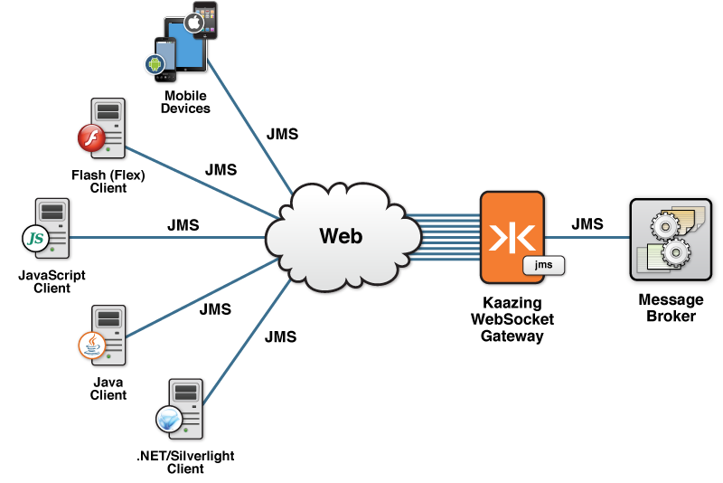
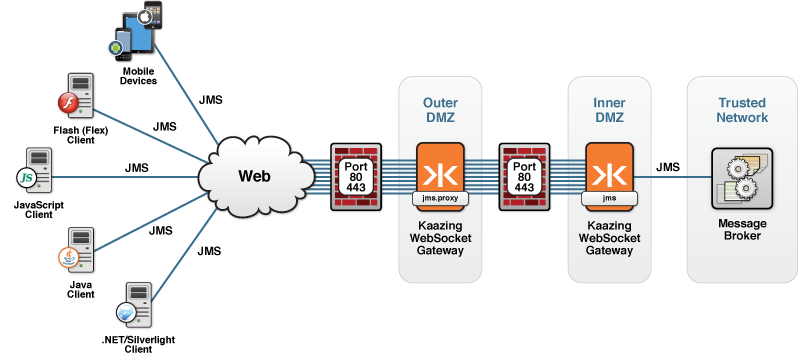

JMS Services for KAAZING Gateway
=====================================

This document describes the JMS services for KAAZING Gateway that you can use in a Gateway configuration:

-   [jms](#jms)
-   [jms.proxy](#jmsproxy)

jms
--------------------------

This type of service is used to expose the `jms` service, which allows you to configure the Gateway to connect to any back-end JMS-compliant message brokers. To learn about common Gateway production deployments, see [Common KAAZING Gateway Production Topologies](c_topologies.md).

 **Note:** To integrate the Gateway with different JMS-compliant message brokers, see [About Integrating KAAZING Gateway and JMS-compliant message brokers](../integration-jms/o_jms_integrate.md). 

The `jms` service *offloads connections* and topic subscriptions using a single connection between the Gateway and your JMS-compliant message broker. The main benefit of offloading is that the Gateway scales to a massive number of clients while putting minimal pressure on your messaging system.

-   *Offloading connections* means the `jms` service can maintain many client connections through a single connection to the JMS-compliant message broker.
-   *Offloading topic subscriptions* means that the `jms` service can maintain many clients subscribing to a given topic using a single subscription to the JMS-compliant message broker.

JMS connections and topic subscriptions are described in [How the jms Service Handles Connections](#how-the-jms-service-handles-connections) and [How the jms Service handles Topic Subscribers](#how-the-jms-service-handles-topic-subscribers).

The following figure shows how each incoming client connection enters the Gateway, then connects through the `jms` service using a single connection to the JMS-compliant message broker.



**Figure: Offloading Connections Using the `jms` Service**

Most JMS destinations (queues and topics) are created and treated as static resources, but dynamic destinations, known as temporary destinations (temporary topics and temporary queues), are also supported by the `jms` service. Temporary destinations are created dynamically, not statically by an administrator, to automatically enable private, scalable communication between the client and the server.

When a client subscribes to a destination, a corresponding, new temporary JMS destination is created implicitly by the client application, and is used as a unique destination for replies. Because the identity of the temporary destination is known only by the connection or session that created it, the JMS header field `JMSReplyTo` is always used in conjunction with temporary destinations to communicate the identity of the temporary destination in the message header.

Upon receiving a message, the client picks up the identity of the temporary destination from the `JMSReplyTo` field in the message header, performs the requested workflow, and then sends the message out to the temporary destination. The temporary destination exists only for the duration of the connection and is removed on the server side as soon as the connection or session is closed.

JMS implementations provide a factory class in their JAR files. For example, the Apache ActiveMQ class, `org.apache.activemq.jndi.ActiveMQInitialContextFactory`, is included in the `activemq-all-5.10.0.jar` file that ships with the Gateway. The Gateway connects directly to Apache ActiveMQ when you use the `jms.proxy` service. To use another JMS implementation, see [About Integrating KAAZING Gateway and JMS-compliant message brokers](../integration-jms/o_jms_integrate.md) to learn how to copy the implementation's JAR file to the `GATEWAY_HOME/lib` directory and specify the name of the class as the value for the `env.java.naming.factory.initial` property.

### How the jms Service Handles Connections

To support very large numbers of Web clients (in the tens of thousands or even hundreds of thousands), the `jms` service uses just one or a few JMS connections to the JMS-compliant message broker to service all clients. This is known as *connection sharing* or *connection fanout*. By default, the `jms` service uses just one connection but you can configure a specific number of broker connections using the [`connection.count`](#jms-service-properties) service property.

Each client connection is associated with one of the broker connections for the duration of the client connection. If the broker reports an exception on a particular connection, then that connection is closed and reestablished automatically by the `jms` service, without interrupting service to the associated clients.

### How the jms Service Handles Topic Subscribers

When a client subscribes to a topic (that is, creates a [`MessageConsumer`](https://docs.oracle.com/javaee/7/api/javax/jms/MessageConsumer.html) object on a topic), the `jms` service establishes a corresponding subscription with the JMS-compliant message broker. That same subscription is then used to service all other clients subscribing to the same topic and JMS API message selector (if applicable). By offloading topic subscriptions in this way, a single topic subscription to the broker can service tens of thousands of clients subscribing to the same topic. This feature is known as *subscription sharing* or *subscription fanout*.

The topic subscription is maintained as long as at least one client is subscribed to that topic, unless you specifically configure the topic to maintain a *permanent topic subscription* (described in the [How the JMS Service Handles Connections](#how-the-jms-service-handles-connections) section).

If there are multiple broker connections (that is, the [`connection.count`](#connectioncount) service property is set to a value greater than 1), each with clients subscribed to the topic, then a *shared wildcard subscription* (described in the [How the JMS Service Handles Connections](#how-the-jms-service-handles-connections) section) is made to the topic on each connection.

**Note:** You can use [wildcards](#using-wildcards-with-last-value-cache-or-delta-messaging) to identify large numbers of topics on which you want to configure a last value cache.

#### Permanent topic subscriptions

Configuring permanent topic subscriptions is primarily intended for use with [last value cache](#last-value-cache). To configure the `jms` service to maintain permanent subscriptions with the JMS-compliant message broker for certain topics:

1.  Add `topic` elements to the `jms` service properties in the Gateway configuration file.
2.  Configure the [`subscription.lifetime`](#subscriptionlifetime) topic property with its value set to `connection`. When the [`subscription.lifetime`](#subscriptionlifetime) topic property is set to `connection`, a subscription to the topic is established automatically during Gateway startup for each connection that the `jms` service establishes with the broker.

If subscription to the topic fails (for example, because the topic is not defined in the JMS-compliant message broker), then this is treated the same as a failure to connect to the JMS-compliant message broker. That is, the connection is closed and reattempted later, depending on the setting of the [`reconnect.delay`](#reconnectdelay) service property (the default is a five-second delay). The error message from the failed attempt to subscribe is reported in the Gateway error log. Clients cannot connect to the `jms` service until the subscription succeeds.

#### Shared wildcard subscriptions

To support a greater level of subscription fanout, you can configure the [subscription.sharing](#subscriptionsharing) topic property to use a single subscription to a wildcard topic to service all clients subscribing to any topics matching that wildcard. In this case, the Gateway establishes a subscription to the wildcard topic with the JMS-compliant message broker whenever a client first subscribes to any matching topic (or during Gateway startup if the [subscription.lifetime](#subscriptionlifetime) topic property is set to connection). The Gateway then receives and processes all messages arriving on that wildcard topic, routes the messages to the appropriate clients depending on the actual topic to which the message was originally sent, or drops the message if there are no matching clients.

Shared wildcard subscriptions are useful in systems with a great many topics (for example, thousands or more) where clients each subscribe to a large number of different topics. In such cases, it is more efficient to service clients using a single wildcard subscription to the JMS-compliant message broker instead of using a separate subscription to each individual topic. Subscription sharing is especially useful when used with last value cache.

See [Last Value Cache](#last-value-cache) for more information and examples.

The following sections provide more information about the `jms`Service for KAAZING Gateway:

-   [Durable Subscribers](#durable-subscribers)
-   [Last Value Cache](#last-value-cache)
-   [Delta Messaging](#delta-messaging)
-   [Using Wildcards with Last Value Cache or Delta Messaging](#using-wildcards-with-last-value-cache-or-delta-messaging)
-   [Message Conflation](#message-conflation)
-   [jms Service Required Elements](#jms-service-required-elements)
-   [jms Service Properties](#jms-service-properties)
-   [jms Service Properties for the topic Element](#jms-service-properties-for-the-topic-element)
-   [jms Service Environment Properties](#jms-service-environment-properties)
-   [Configuration Examples: jms Service](#configuration-examples-jms-service)

### Durable Subscribers

The `jms` service also supports durable subscriptions with certain JMS-compliant message brokers. This support ensures that all messages are retained until they are received by the subscriber or until they expire. Even if the subscriber goes offline, messages are retained and delivered once the subscriber returns and resumes the durable subscription. To use durable subscriptions with the Gateway, you may need to configure your JMS-compliant message broker to accept durable subscriptions. As an administrator, you need to determine the durable subscriber names used by the Gateway.

#### Configuring the JMS-Compliant Message Broker to Accept Durable Subscriptions

The Gateway support for durable subscriptions depends on your JMS-compliant message broker:

-   **TIBCO Enterprise Message Service (EMS)**: The Gateway supports durable subscriptions without additional configuration.
-   **Apache ActiveMQ**: The Gateway does not currently support the use of durable subscriptions with ActiveMQ.
-   **Informatica Ultra Messaging (UM)**: The Gateway supports durable subscriptions with the following requirements: you must use the fixed client ID value on all connections and you must specify the same fixed client ID value with the `anonymous.clientid.pattern` property on the `jms` service. This property allows the Gateway to verify that all connections to Informatica UM are using the same client ID, which is essential for durable subscribers to work properly.
-   **Other message brokers**: Durable subscribers may work with other JMS-compliant message broker if the message broker implements specific behavior for the `createDurableSubscriber()` method as required by the Gateway. The message broker must support one of the following conditions:
    -   Creating durable subscribers using JMS Connections with no client ID set. This capability is in the emerging JMS 2.0 specification, and is already supported by some message brokers (such as TIBCO EMS). The durable subscription must be able to migrate to another connection without closing the first connection.
    -   Creating durable subscribers on multiple JMS connections that ALL have the same client ID. The durable subscription must be able to migrate to another connection without closing the first connection. In this case, to use durable subscribers with such JMS-compliant message broker, the provider must be configured to use the fixed client ID value on all connections, and you must specify the same fixed client ID value with the `anonymous.clientid.pattern` property on the `jms` service. This property allows the Gateway to verify that all connections to the JMS-compliant message broker are using the same client ID, which is essential for durable subscribers to work properly.
        </p>


#### Configuring Durable Subscriber Names Used by the Gateway

To create a durable subscriber for a topic, the client application calls the `createDurableSubscriber()` method of a `session` object and specifies a durable name and a destination. When your client application creates a durable subscriber, the Gateway creates a corresponding durable subscriber on the JMS-compliant message broker. To allow the Gateway to do this, you must either configure the JMS-compliant message broker to allow the Gateway to use dynamic durable subscribers or statically predefine in your JMS-compliant message broker all the durable subscribers that you will be using.

The durable names that the Gateway will use depend on whether or not a client ID is set. For instructions for determining how to set the client ID in the application, see the [client how-to](../index.md) appropriate to the language of your application and follow the steps for using the client library. The following table describes the durable names the Gateway uses:

| If the client application ... | The Durable Name ...                                                                                                                                                                                                                                                                                   | The Gateway ...                                                                                                                                                                                                                                                                                                                                                                                                                                                                                                                  |
|-------------------------------|--------------------------------------------------------------------------------------------------------------------------------------------------------------------------------------------------------------------------------------------------------------------------------------------------------|-----------------------------------------------------------------------------------------------------------------------------------------------------------------------------------------------------------------------------------------------------------------------------------------------------------------------------------------------------------------------------------------------------------------------------------------------------------------------------------------------------------------------------------------|
| Does not set a client ID      | The durable name the client passes into the `createDurableSubscriber()` method must be globally unique. Each user of the application must use a distinct name because the Gateway uses the same name for the back-end durable subscriber on the JMS-compliant message broker.                          | Creates a durable subscriber in the JMS-compliant message broker using only the given durable name. For example, if the client application creates a durable subscriber with the name `user1_price` then the Gateway creates a back-end durable subscriber in the JMS-compliant message broker with the name `user1_price`.                                                                                                                                                                                                                |
| Sets a client ID              | The same durable name can be used by multiple clients (or users) when creating a durable subscriber, because the different durable subscribers are distinguished by the different client ID values. The client ID forms part of the full, unique identifier of the back-end durable subscription name. | Dynamically creates a corresponding durable subscriber on the JMS-compliant message broker whenever the client application creates a durable subscriber. The back-end durable name is formed from the durable name given by the client application and the client ID set on the client application’s connection in the format specified by the [`client.durable.name.format`](#clientdurablenameformat) property on the `jms` service or the [`client.durable.name.format`](#clientdurablenameformat) property on the `jms.proxy` service. |

The [documentation for developers](../index.md) provides complete information about using the Gateway client libraries to create durable subscribers. Also, see the JMS API documentation for more information about the [createDurableSubscriber](http://docs.oracle.com/javaee/6/api/javax/jms/Session.html#createDurableSubscriber(javax.jms.Topic,%20java.lang.String "Interface Session") method.

### Last Value Cache

You can configure the Gateway to hold recent messages for a topic in a *last value cache*. When you enable last value cache and a client subscribes to a destination, the Gateway first delivers any cached messages to the client and then delivers the live stream of messages.

Last value cache is especially useful for clients that make a new subscription to a topic and want to immediately receive the most recent message history for the topic. For example, if messages are delivered hourly, a client connection that arrives 30 minutes into the hour can get the latest message immediately. Some use cases for the last value cache feature include:

-   When your publisher publishes messages infrequently, or unpredictably
-   When a client would need to wait too long for the next message when they first subscribe

**Note:** Last value cache only applies to non-durable topic subscriptions. Last value cache does not apply to queue receivers or durable topic subscribers, because the JMS-compliant message broker maintains state on those destinations (queues and durables) and tracks whether messages should be redelivered.

You do not need to write any custom code to use last value cache. Last value cache is disabled by default (per standard JMS behavior) but you can easily enable it by editing the Gateway configuration. For example, edit the `gateway-config.xml` file to add a `topic` element and set the [`cache.size`](#how-the-jms-service-handles-topic-subscribers) property along with any additional associated last value cache properties for the topics on which last value cache behavior is desired.

When you enable last value cache for a topic, then the `jms` service:

-   Creates a separate in-memory last value cache **for each topic subscription made to the JMS-compliant message broker**.
-   Maintains the last value cache for the duration of that subscription. See [How the JMS Service handles Topic Subscribers](#how-the-jms-service-handles-topic-subscribers) for a description of the lifecycle of topic subscriptions to the JMS-compliant message broker.

For more information about configuration properties, see [jms Service Properties for the topic Element](#jms-service-properties-for-the-topic-element).

#### Configuring and Using Last Value Cache

-   [Enable Last Value Cache on Specific Topics](#enable-last-value-cache-on-specific-topics)
-   [Configure Last Value Cache to Populate (Bootstrap) In-Memory Last Value Cache](#configure-last-value-cache-to-populate-bootstrap-in-memory-last-value-cache)
-   [Configure a Shared Wildcard Subscription to Minimize the Number of Topic Subscriptions and Use a Single Shared Cache](#configure-a-shared-wildcard-subscription-to-minimize-the-number-of-topic-subscriptions-and-use-a-single-shared-cache)

##### Enable Last Value Cache on Specific Topics

The following example enables last value cache on a specific topic `events.calendar` and any topics that match a wildcard name of `events.football.>`. Each topic needs to be in its own `topic` element. In this example, the Gateway retains the last message for the destinations given. When a new client subscribes to one of those destinations, the last value cache messages are sent to the client before any new live messages from the broker.

``` xml
<service>
  <accept>ws://gateway.example.com/jms</accept>
 
  <type>jms</type>
 
  <properties>
    <topic>
      <!-- Single topic -->
      <name>events.calendar</name>
      <cache.size>1</cache.size>
      <cache.durable.name.format>lvc_%s</cache.durable.name.format>
      <cache.durable.client.id>client1</cache.durable.client.id>
    </topic>
    
    <topic>
      <!-- Broker specific topic wildcard -->
      <name>events.football.></name>
      <cache.size>1</cache.size>
    </topic>
    
    <topic>
       ...
    </topic>
  </properties>
</service>
```

**Note:** Set the [`cache.size`](#cachesize) property to 1 to handle the majority of use cases. (The [`cache.size`](#cachesize) property defaults to 0.) See [jms Service Properties for the topic Element](#jms-service-properties-for-the-topic-element) for information about the [`cache.size`](#cachesize) property and other topic properties.

##### Configure Last Value Cache to Populate (Bootstrap) In-Memory Last Value Cache

You can optionally configure last value cache to populate (bootstrap) its in-memory last value cache for a given topic whenever recent messages for that topic are not already available in cache.

How you configure bootstrapping depends on whether or not your JMS-compliant message broker already has built-in support for replaying prior messages (sometimes referred to as *last value cache* or *subscription recovery*).

-   If your JMS-compliant message broker supports replaying prior messages, then enable it for the topics in question and do not specify the [cache.durable.name.format](#cachedurablenameformat) and [cache.durable.client.id](#cachedurableclientid) properties in the Gateway configuration. Some brokers already have built-in support for replaying prior messages.  For example, see the [Apache ActiveMQ documentation](http://activemq.apache.org/subscription-recovery-policy.html) for more information about the ActiveMQ subscription recovery policy.
-   If your JMS-compliant message broker does not already have built-in support for replaying prior messages, then you should set the [cache.durable.name.format](#cachedurablenameformat) and [cache.durable.client.id](#cachedurableclientid) properties to allow the Gateway to populate (bootstrap) the last value cache for a given topic when needed using a durable subscriber.

    To trigger bootstrapping, specify the [cache.durable.name.format](#cachedurablenameformat) and [cache.durable.client.id](#cachedurableclientid) topic properties, as shown in the following example.

    ``` xml
    <service>
      <accept>ws://gateway.example.com/jms</accept>
      
      <type>jms</type>
      
      <properties>
         
        <topic>
          <!-- Broker specific topic wildcard -->
          <name>events.></name>
          <cache.size>1</cache.size>
          <cache.durable.name.format>lvc_%s</cache.durable.name.format>
          <cache.durable.client.id>client1</cache.durable.client.id>    
          <subscription.lifetime>connection</subscription.lifetime>
        </topic>
         
        <topic>
           ...
        </topic>
      </properties>
    </service>
    ```

Bootstrapping last value cache is useful to make sure last value messages are always available for clients, even when the Gateway is restarted, or in a situation where all clients unsubscribe and then one client re-subscribes. The preceding example includes the [`subscription.lifetime`](#subscriptionlifetime) topic property that is set to `connection`. In this case, bootstrapping efficiently preloads the cache before clients first subscribe, getting the high message volume work done so the users do not experience lag when first subscribing to the topic.

If the [`subscription.lifetime`](#subscriptionlifetime) topic property is set to `consumer`, then bootstrapping is performed only when a client first subscribes to the topic through the Gateway. The bootstrap process uses a durable subscriber that is created by the Gateway the first time bootstrap occurs (unless it was manually created externally in advance).

The last [`cache.size`](#cachesize) messages sent to the topic since the durable subscriber was created are replayed from the cache (or the durable subscriber) to each new client that subscribes to the topic. Configuring the [`subscription.lifetime`](#subscriptionlifetime) topic property is described in the [Configure a Shared Wildcard Subscription to Minimize the Number of Topic Subscriptions and Use a Single Shared Cache](#configure-a-shared-wildcard-subscription-to-minimize-the-number-of-topic-subscriptions-and-use-a-single-shared-cache) section.

If your broker supports it, you should specify an upper bound on the number of messages to retain on the durable subscriber that is used for bootstrap. Doing so helps to limit overhead on the broker. In addition, you might want to set a time to live (TTL) when publishing messages so they live in the broker only long enough for newer messages to replace them. For example, if messages are published every hour, then set the expiration to one hour to be certain there is at least one message persisted by the broker at all times while keeping the total number of messages bounded.

The broker does not persist messages until the durable subscriber is created. Because the Gateway only creates the durable subscriber when a client first subscribes to the topic (or when the Gateway is first started if [`subscription.lifetime`](#subscriptionlifetime) is set to `connection`), the first client does not see any cached last value messages. For the first client to see the messages, you can manually create the durable subscriber and then send some messages to the topic before starting up the Gateway. The Gateway then replays those messages to all clients.

See [`cache.durable.name.format`](#cachedurablenameformat), [`cache.durable.client.id`](#cachedurableclientid), and [`subscription.lifetime`](#subscriptionlifetime) for more information.

##### Configure a Shared Wildcard Subscription to Minimize the Number of Topic Subscriptions and Use a Single Shared Cache

Unless you configure the special topic properties, [`subscription.lifetime`](#subscriptionlifetime) and [`subscription.sharing`](#subscriptionsharing), the in-memory last value cache for a given topic comes and goes according to whether or not any clients are currently subscribed to that topic. For consistent availability of last messages when clients subscribe, you must do one of the following:

-   Configure your JMS-compliant message broker to provide last messages (if the broker has that capability)
-   Configure the `jms` service to bootstrap last value cache
-   Use the [`subscription.sharing`](#subscriptionsharing) and [`subscription.lifetime`](#subscriptionlifetime) topic properties

The [`subscription.sharing`](#subscriptionsharing) and [`subscription.lifetime`](#subscriptionlifetime) topic properties are specifically designed to:

-   Provide consistent last value messages across all topics matching a given wildcard.
-   Reduce the number of durable subscribers needed to bootstrap last value cache.
-   Perform bootstrap during Gateway startup to avoid clients experiencing delays.

The following topic configuration example shows how you might configure [`subscription.sharing`](#subscriptionsharing) and [`subscription.lifetime`](#subscriptionlifetime):

``` xml
   
    <topic>
      <!-- Broker specific topic wildcard -->
      <name>quotes.*.*</name>
      <cache.size>1</cache.size>    
      <subscription.lifetime>connection</subscription.lifetime>
      <subscription.sharing>wildcard</subscription.sharing>
    </topic>
```

With this configuration, the `jms` service establishes a subscription to the wildcard topic name `quotes.*.*` immediately after establishing the connection to the JMS-compliant message broker during Gateway startup. An in-memory cache of last messages is maintained from that time on. When a client subscribes to any topic matching the wildcard (for example, `quotes.NASDAQ.NFLX`), any available last messages matching that destination are served from the cache, and any incoming matching live messages are delivered to the client. This applies even if the client subscribes to a wildcard, provided that wildcard matches the configured wildcard, for example: `quotes.NASDAQ.*`.

A shared wildcard subscription is recommended when last value cache functionality is needed on a very large number of topics (hundreds, thousands or even hundreds of thousands) because it greatly offloads the JMS-compliant message broker (by using a single subscription to it) and provides a consistent cache of last value messages.

##### When should you use shared wildcard subscriptions? 

It is important to know the disadvantages and tradeoffs when using shared wildcard subscriptions. The Gateway must process all messages on all topics matching the wildcard (`quotes.*.*`) to keep the last value cache up to date in memory. If the message rate is high that may use significant memory and CPU, which is wasted if no clients actually subscribe to matching topics. It is important to be judicious in choosing which wildcard topic names to configure in this way. For example:

-   If you know that clients only subscribe to NASDAQ quotes, then it is more efficient to set the wildcard name to `quotes.NASDAQ.*`.
-   If you know that clients only subscribe to NASDAQ or NYSE, then define two separate topic configurations: one for `quotes.NASDAQ.*` and one for `quotes.NYSE.*`.

##### Memory Usage with Shared Wildcard Subscriptions

How you set up shared wildcard subscriptions is also important when it comes to memory usage. If you use a shared wildcard subscription with last value cache, especially a permanent one (with `subscription.lifetime=connection`), the memory taken up by the cache increases each time a message is received on a new topic matching the shared wildcard subscription established by the Gateway. For example, if the configured wildcard name is `quotes.NASDAQ.*` and messages are sent to 100,000 different topics (such as stock tickers), and the configured `cache.size` is 1 (message per concrete topic), then 100,000 messages are cached in memory.

The exact amount of memory used depends on the nature of the messages (property set by the application, length of the message body, and so on). In fact, in test cases where text messages with a 200-character body and no application-specific properties were set, the memory used per cached message was approximately 920 bytes; 100,000 cached messages used 92 megabytes of memory. Depending on the size of your messages, this number might be larger or smaller for your applications.

To optimize memory usage with last value cache:

-   Avoid using wildcards that are too sweeping by focusing your wildcard subscriptions as described in [When should you use shared wildcard subscriptions?](#when-should-you-use-shared-wildcard-subscriptions).
-   Consider setting an expiration time (TTL) so messages live in the broker only long enough for newer messages to replace them. Cached entries are only cleared if a user subscribes to a particular topic and matching messages in the cache are found to have expired.
-   Follow the recommendations in [Best Practices for Last Value Cache](#best-practices-for-last-value-cache).

#### Best Practices for Last Value Cache

##### Focus shared wildcard subscriptions as narrowly as possible

When configuring shared wildcard subscriptions (specifying the [`subscription.sharing`](#subscriptionsharing) topic property as wildcard), target the subscription as narrowly as possible to reduce unnecessary messages being delivered from the message broker to the Gateway. For example, imagine you have the following configuration:

``` xml
    <topic>
      <!-- Broker specific topic wildcard -->
      <name>events.></name>
      <cache.size>1 </cache.size>
    </topic>
```

For instance, say the subscription `events.>` resolves to thousands of topics. All of the messages for those topics are now delivered to the Gateway. If your clients only subscribe to a small number of those topics, then the majority of messages are delivered to the Gateway and cached when there are no consumers that need them. This uses unnecessary resources.

In this case, a more specific subscription is better. If your clients all subscribe to `events.football`, then use this configuration:

``` xml
    <topic>
      <!-- Broker specific topic wildcard -->
      <name>events.football.></name>
      <cache.size>1</cache.size>
    </topic>
```

Now the Gateway will not receive and cache messages for `events.baseball`, `events.cricket`, `events.racing`, and so on.

Specifying the wildcard subscription as narrowly as possible reduces memory usage, gives better performance, and reduces load on the message broker.

##### Set `subscription.sharing` to wildcard

If `subscription.sharing` is unspecified or is set to `exact` (the default), then each unique topic name results in a separate subscription from the Gateway to the message broker and, if bootstrap is enabled, to an associated durable subscriber.

For example, if consumers subscribe to `events.football` and `events.baseball`, that results in two subscriptions from the Gateway to the broker. It does not matter how many consumers there are, as it is unique topic names that matter, not the number of consumers subscribing to them.

If your client base subscribes to a large number of unique topic names, that results in a large number of subscriptions from the Gateway to the broker. But by setting [`subscription.sharing`](#subscriptionsharing) to `wildcard` and specifying a wildcard subscription in your Gateway configuration, you can reduce the number of individual subscriptions from the Gateway to the message broker.

For example, if your Gateway has the following configuration, then it defaults to `exact` because `subscription.sharing` is unspecified:

``` xml
    <topic>
      <!-- Broker specific topic wildcard -->
      <name>events.></name>
      <cache.size>1</cache.size>
    </topic>
```

If consumers subscribe to the topics `events.football`, `events.baseball`, `events.cricket`, and `events.racing`, then that results in four subscriptions from the Gateway to the message broker.

Now, let's change the configuration wildcard to the following:

``` xml
    <topic>
      <!-- Broker specific topic wildcard -->
      <name>events.></name>
      <cache.size>1</cache.size>
      <subscription.sharing>wildcard</subscription.sharing>
    </topic>
```

If consumers subscribe to the topics `events.football`, `events.baseball`, `events.cricket`, and `events.racing`, then there is only one subscription from the Gateway to the message broker. That's because the subscription to `events.>` results in messages that also apply to `events.football`, `events.baseball`, `events.cricket`, and `events.racing`.

Setting [`subscription.sharing`](#subscriptionsharing) to `wildcard` in this way provides several benefits:

-   Minimizes the number of subscriptions to the message broker, reducing load on the broker.
-   Allows the Gateway to have only one last value cache instead of one for each unique subscription.
-   If bootstrap is enabled, then last value cache uses a single durable subscriber instead of four.

##### Set `cache.size` to `1`

By default, the `cache.size` property is set to `0`, which means that last value cache is disabled. In general, you should set the [`cache.size`](#cachesize) property to 1 to handle most use cases.

``` xml
    <topic>
      <!-- Broker specific topic wildcard -->
      <name>events.></name>
      <cache.size>1</cache.size>
    </topic>
```

While replaying messages from the last value cache, the Gateway delivers higher priority messages before lower priority messages for each topic if the [`cache.size`](#cachesize) property is set to a value greater than one.

##### Enable Clustering when Using Last Value Cache with Durable Subscriptions

If you use `cache.durable.client.id` or `cache.durable.name.format` in your last value cache configuration, then a durable subscription is made to the JMS messaging system. The connection for this subscription is very short lived, usually sub-second, existing just long enough to retrieve newer messages.

If you have more than one Gateway configured this way, then multiple Gateways connect with the same durable client ID. The JMS specification says that you cannot have multiple subscribers with the same client ID at the same time. Therefore, the best practice is to configure clustering between the gateways so that they can coordinate usage of the durable client ID. Administrators must configure the `cluster` element for each Gateway using `cache.durable.client.id` or `cache.durable.name.format` in a `topic` element of the configuration.

#### Notes

-   Message expiration: The Gateway does not deliver messages to the client if the messages have expired.
-   Handling reconnections: When a client loses connectivity and then reconnects, the current set of messages from the last value cache is replayed, which may cause messages already observed by that client to be sent before the live stream. Following standard JMS practices, the JMSRedelivered field is always set on messages played from the last value cache. The client application can use this field to determine how to process the messages from the last value cache. For information about the `JMSRedelivered` property in a KAAZING Gateway client API, see the [Client API Documentation](../index.md).
-   Wildcards: You can use [wildcards](#using-wildcards-with-last-value-cache-or-delta-messaging) to identify large numbers of topics on which you want to configure a last value cache.

### Delta Messaging

Delta messaging, when enabled, results in the Gateway sending a full message to the client, and thereafter only sending the deltas for subsequent messages. Configuring the Gateway to send deltas reduces bandwidth utilization and ensures clients receive current data.

Deltas can be any of the following:

-   JMS Message Headers
-   JMS Message Properties
-   JMS MapMessage Items

Delta messages are disabled by default and must be enabled in the configuration. To enable delta messages, add a `topic` element to the properties for the `jms` service configuration and specify the topics on which to enable delta messages. You can name individual topics or specify multiple topics using wildcard syntax. Then set the `message.delivery.strategy` property to `delta`.

#### Notes

-   Delta messages only apply to topics. Messages on queues or durable subscriptions to topics are not eligible for delta messages because they provide guaranteed message delivery (as described in the [JMS specification](http://download.oracle.com/otndocs/jcp/7195-jms-1.1-fr-spec-oth-JSpec/)).
-   To achieve bandwidth reduction with delta messaging, ensure that applications convey changes from one message to the other via message properties or using MapMessages (rather than to the body of a BytesMessage or TextMessage).
-   Wildcards: You can use [wildcards](#using-wildcards-with-last-value-cache-or-delta-messaging) to identify large numbers of topics on which you want to configure delta messaging.

After you enable delta messaging, the Gateway automatically computes deltas. The publisher and client application are unaware of the optimization. The publisher will always publish complete messages, and the client application will always receive complete messages.

See the `message.delivery.strategy` property and [Example 3: JMS service with Delta Messaging](#example-3-jms-service-with-delta-messaging) for more information and an example.

### Using Wildcards with Last Value Cache or Delta Messaging

You can use wildcards to configure last value cache for a large number of topics or to apply delta messaging to a number of topics without listing every topic in the Gateway configuration. Wildcard syntax differs depending on your JMS-compliant message broker. The wildcard name you use must conform to the syntax expected by your JMS-compliant message broker.

A common syntax is the "`*`" and "`>`" syntax. The "`*`" syntax will match any name on a path, and the "`>`" syntax recursively matches any destination starting from this name. If you use a message, refer to the broker documentation for more syntax information. (For example, if you are using a JMS-compliant message broker such as Apache ActiveMQ, see the [Apache ActiveMQ documentation](http://activemq.apache.org/wildcards.html) for more information about wildcards. In such a scenario, a JMS-compliant message broker that uses different characters might require that you configure the service properties `wildcard.separator`, `wildcard.any.child`, and `wildcard.any.descendent`.

**Note:** For IBM WebSphere MQ and RabbitMQ, the Gateway dynamically sets the following (required) wildcard properties:

`wildcard.any.descendent=#`
`wildcard.separator=/`
`wildcard.any.child=+`


#### Client Subscriptions Versus Gateway Configuration

Using wildcards in the Gateway configuration simplifies administration by enabling you to use a single symbol (wildcard) instead of listing every static topic and also lets you configure for dynamic topics where the topic names are not already known. Regardless of your use of wildcards in the Gateway configuration, the client can subscribe to specific named topics, or use wildcard subscriptions. The wildcard syntax you specify in the Gateway configuration does not have to be used in the client subscription; the client subscription and topic specification in the configuration are independent of each other.

The interplay between the client subscription and the Gateway configuration occurs when the client subscribes. The following table illustrates some examples of how different client subscriptions might or might not match topic definitions in the configuration. The topic name given in the client subscription is matched against the names given in the topic entries in the Gateway configuration. If there is no match, then delta messages are not applied.

The set of real topic names matched (or resolved by the broker after applying wildcards) for the client subscription must match or be a subset of the set matched for the configuration. In other words, the "Client Subscription" column in the following table must match or be a subset of the "Gateway Configuration" column.

| Gateway Configuration | Client Subscription          | Result   |
|-----------------------|------------------------------|----------|
| `events.football`     | `events.football.*`          | No match |
| `events.football`     | `events.football.>`          | No match |
| `events.football.*`   | `events.football.>`          | No match |
| `events.football.*`   | `events.football`            | No match |
| `events.football.>`   | `events.football.*`          | Match    |
| `events.football.>`   | `events.football.saturday.*` | Match    |
| `events.football.>`   | `events.football.saturday.>` | Match    |

### Message Conflation

Message conflation enables slower consumers to receive an approximation of higher rate message flows so that they do not get too far behind in the message stream. The Gateway performs message conflation, where a new message replaces the previous message, in a situation where a client cannot keep up with the live stream. KAAZING Gateway conflates messages on a topic from the JMS-compliant message broker arriving for that client. Whenever the client is able to start receiving messages, it receives the latest data. If all clients keep up with the live message stream, then no conflation occurs.

Conflation is always enabled on all topics and does not require configuration or custom code. Conflation does not apply to queues and durable topic subscriptions because they provide guaranteed message delivery, which requires all unexpired messages to be delivered to the client.

The Gateway conflates JMS messages that are in the same *series*---that is, the messages have the same body type (specifically, MapMessage, TextMessage, and BytesMessage), JMSDestination, JMSType and JMSPriority. For example:

-   Messages must have the same JMSDestination to conflate (this is only relevant for wildcard subscriptions). The Gateway will not conflate messages on destination `events.football.manchester-vs-liverpool` with a message on destination `events.football.united-vs-arsenal`.
-   Messages must have the same JMSType to conflate. The Gateway will not conflate a message of JMSType=car with a message of JMSType=plane.
-   Messages must have the same JMSPriority to conflate. If there are messages with multiple priorities, they are conflated and cached separately and then replayed in priority order from the cache.

The Gateway also conflates messages in a shared topic. For example, a single topic might have messages for stock prices for different symbols. If you do not wish messages in a shared topic to conflate, then you can set the JMSType for different messages to be different, so that the Gateway only conflates messages of the same type.

When a client cannot keep up with the message flow, the Gateway must cache the messages that cannot be delivered into a conflation cache in order to apply the rules (listed previously) for conflation. The cache contains one entry for each message series such that there is an entry in the cache for each unique combination of JMSDestination, JMSType and JMSPriority.

The maximum number of entries in the conflation cache defaults to 100 and is controlled by the [`maximum.conflation.cache.size`](#maximumconflationcachesize) service property. If cache size is not sufficient, then warning messages are written to the Gateway log file, and you should increase the value of the [`maximum.conflation.cache.size`](#maximumconflationcachesize) property.

The Gateway delivers all messages from the [last value cache](#last-value-cache) without conflation. After the client is on the live stream, messages automatically conflate if the client becomes a slow consumer.

### jms Service Required Elements

The `jms` service has the following required elements:

-   `accept`: the URL at which the service accepts connections.
-   `properties`: the properties needed to run the Gateway. The table in [jms Service Properties](#jms-service-properties) describes the required and optional properties in more detail.

### jms Service Properties

You can set the properties described in the following list at the service level on the `jms` service.

See also [jms Service Properties for the topic Element](#jms-service-properties-for-the-topic-element) for a list of properties that you can set at the topic level. Properties set at the topic level override values set at the service level.

#### <a name="anonymousclientidpattern"></a>`anonymous.clientid.pattern`

  **Required?** Yes
    
  This property is required if the JMS-compliant message broker is configured to use a fixed client ID. For durable subscribers, set this property to the value of the fixed clientID. For example, on connections created using the UM connection factory, the clientID is preset to UME1. Thus, to use durable subscribers with UM, you must set anonymous.clientid.pattern to UME1.
  - If this property is set, then the Gateway verifies that the clientID is set to the specified value on every JMS connection. 
  - If this property is not set, then the Gateway disallows the creation of durable subscribers because durable subscribers will not be able to function properly.

#### <a name="applicationid"></a>`application.id`

  **Required?** Optional

  A unique identifier used to audit messages produced by clients using this service. See [Configure Auditing Messages Produced by Clients](../security/p_auditing_jms_secure.md) for more information.
    
#### <a name="authorizationfactory"></a>`authorization.factory`
 
  **Required?** Optional

  The value of this property is a fully qualified class name of an implementation of the abstract class: `com.kaazing.gateway.jms.server.spi.` `security.JmsAuthorizationFactory`. See [Secure Your JMS Configuration](../security/o_jms_secure.md) for more information.
    
#### <a name="authenticationrealm"></a>`authentication.realm`

**Required?** Optional

The value of this property should be one of the `realm` names declared in the `gateway-config.xml` file's `security` section. This value identifies the realm used by the service for authentication.

#### <a name="clientdurablenameformat"></a>`client.durable.name.format` 

**Required?** Optional
    
For durable subscribers, this property specifies a pattern with which to form a back-end durable name from the durable name supplied by the client application in a `createDurableSubscriber()` call and the clientID set by the client application on its JMS Connection object. 

The value of this property must be a valid format string for the Java `String.format()` method, with two string parameters. The Gateway forms the back-end durable name by doing the equivalent of the following call in Java: `String.format(*thePropertyValue*, *ClientID*, *DurableName*)` 

In the string:
- `ClientID` is the clientID set on the JMS connection
- `durableName` is the value of the name parameter passed into the `createDurableSubscriber()` method
- `thePropertyValue` is the value of the `client.durable.name.format` property. 

For example, suppose the client application sets the clientID to `user1` and creates a durable subscriber with name `price_updates`. If the `client.durable.name.format` property value is set to `%s@%s`, then the Gateway creates a corresponding back-end durable subscriber in the JMS-compliant message broker called `user1@price_updates`. If the property is set to `%2\$s:%1\$s` then the Gateway sets the back-end durable name to `price_updates:user1`.

Use this property only if durable subscribers are being used and the client application sets a client ID on its JMS Connection. If the property is not set, calls to `createDurableSubscriber()` result in an exception.

#### <a name="connectioncount"></a>`connection.count`

**Required?** Optional

The number of JMS-compliant message broker connections the service uses to connect to the JMS-compliant message broker. If unspecified, the default value is `1`. In cases where there are a large number of users (for example, thousands of users), performance can be improved by increasing the number of connections using `connection.count`. This is especially the case when all users are subscribing to the same topic. See also the [topic.session.count](#topicsessioncount) property.
    
#### <a name="connectionsecuritycredentials"></a>`connection.security.credentials`
    
**Required?** Optional

The JMS credentials used in the `createConnection()` method. 
 - If `connection.security.credentials.key`is not configured, then the value of this property is treated as a clear-text password. 
 - If `connection.security.credentials.key` is configured, then the value of this property is treated as encrypted credentials. 

See [Configure the Gateway to Use Encrypted Credentials](../security/p_encrypted_jms_secure.md) for more information.

#### <a name="connectionsecuritycredentialskey"></a>`connection.security.credentials.key`

**Required?** Optional
  
The encryption key to use to decrypt the value of `connection.security.credentials` if using encrypted credentials. See [Configure the Gateway to Use Encrypted Credentials](../security/p_encrypted_jms_secure.md) for more information.

#### <a name="connectionsecurityprincipal"></a>`connection.security.principal`

**Required?** Optional
    
The JMS principal used in the `createConnection()` method.

#### <a name="connectionfactoryname"></a>`connection.factory.name`

**Required?** Yes
     
The name of the JMS connection factory. The default value is `ConnectionFactory`.
    
#### <a name="consumerstrategy"></a>`consumer.strategy`

**Required?** Optional

Configure this property to improve performance when a very large number of topic subscriptions are being processed on the Gateway in a short time frame. Choose the `strict` or `optimized` strategy depending on your browser and its conformance to the [Java Message Service Specification Final Release 1.1](http://download.oracle.com/otndocs/jcp/7195-jms-1.1-fr-spec-oth-JSpec/):
 - The `optimized` strategy is only for brokers that are able to support adding message listeners to sessions without having to stop the connection. Apache ActiveMQ, TIBCO EMS. and Informatica UMQ default to the `optimized` strategy and must not be changed.
 - The `strict` strategy strictly conforms to the [Java Message Service Specification Final Release 1.1](http://download.oracle.com/otndocs/jcp/7195-jms-1.1-fr-spec-oth-JSpec/) and will stop a connection before adding message listeners to a session. 

IBM Websphere MQ defaults to the `strict` strategy and must not be changed because IBM Websphere MQ does not support the behavior required to use the `optimized` strategy. All other message brokers (except Apache ActiveMQ, TIBCO EMS. and Informatica UMQ) default to the `strict` strategy and should be changed only if the message broker supports adding message listeners to sessions without having to stop the connection. See the [Java Message Service Specification Final Release 1.1](http://download.oracle.com/otndocs/jcp/7195-jms-1.1-fr-spec-oth-JSpec/) for complete information about setting message listener on sessions.

#### <a name="contextlookupqueueformat"></a>`context.lookup.queue.format`

**Required?** Optional\*    

The format the Gateway should use for queue names when performing JNDI lookups. The value should be a format string following the rules of the Java `String.format` method, with a single parameter in the form "`%s`". For example: `/dynamicQueues/%s`. 
    
\*The `context.lookup.queue.format` property is optional if the `destination.strategy` property is set to the value `session`. Otherwise, `context.lookup.queue.format` is required.
    
#### <a name="contextlookuptopicformat"></a>`context.lookup.topic.format`
    
**Required?** Optional\*

The format the Gateway should use for topic names when performing JNDI lookups. The value should be a format string following the rules of the Java `String.format` method, with a single parameter in the form "`%s`". For example: `/dynamicTopics/%s`. 

\*The `context.lookup.topic.format` property is optional if the `destination.strategy` property is set to the value `session`. Otherwise, the `context.lookup.topic.format` property is required.
    
#### <a name="destinationstrategy"></a>`destination.strategy`

**Required?** Optional

This property specifies how the Gateway looks up or creates JMS Topic and Queue objects. Valid values are:
- `context` This is the default setting. The Gateway performs a JNDI lookup for the topic or queue using the initial context factory specified in the `env.java.naming.factory.initial` property. The name used for the lookup is formed from the requested topic or queue name using the format string set in the `context.lookup.topic.format` or `context.lookup.queue.format` property. For example, if `context.lookup.queue.format` is set to "`/dynamicQueues/%s`" and the client application looks up `/queues/myQueue` or calls `createQueue`(`"/queues/myQueue"`), then the Gateway performs a JNDI lookup using the name `/dynamicQueues/myQueue`.
- `session` The Gateway uses the methods `createTopic` or `createQueue` on the JMS Session object. The `session` value is appropriate when using dynamic destinations (dynamic means they are not predefined in the broker but are instead created by the application as needed) and your broker does not have support for dynamic destinations using JNDI. The `session` value is also appropriate if your broker does not support JNDI lookup, or it is inconvenient to use JNDI lookup.
    
Note that this property only controls how the Gateway behaves. Irrespective of the setting of this property, client applications (using the KAAZING Gateway JMS client library) can lookup or create Topic and Queue objects either by using the `session.createTopic()` method (for example, `Topic myTopic = session.createTopic("/topic/myTopic")`, or by performing a JNDI lookup using the `initialContext.lookup()` method (for example, `Topic myTopic = initialContext.lookup("/topic/myTopic"`). The KAAZING Gateway JMS client libraries currently require the "`/topic/`" or "`/queue/`" prefix even when using `createTopic` or `createQueue`.
    
#### <a name="durablemaximumpendingacknowledgments"></a>`durable.maximum.pending.acknowledgments`

**Required?** Optional

For durable subscribers, specifies the maximum number of pending acknowledgments in flight for each subscription. If unspecified, then the value defaults to [maximum.pending.acknowledgments](#maximumpendingacknowledgments). 
    
**Note:** If your JMS provider does not support individual message acknowledgments, the value for this property is forced to 1 to allow the Gateway to ensure JMS-compliant behavior and the Gateway logs a warning message. In this case, you must ensure your client applications acknowledge each message received from a queue or durable subscriber. Otherwise, the client will receive only one message from that queue or durable subscriber. See [Troubleshoot Your Clients](https://github.com/kaazing/gateway/blob/develop/doc/troubleshooting/p_dev_troubleshoot.md) for client-specific troubleshooting tips.
    
#### <a name="durableredeliveryscope"></a>`durable.redelivery.scope`

**Required?** Optional
    
For durable subscribers, use this property to specify how the Gateway triggers the JMS-compliant message broker to redeliver unacknowledged messages on a durable subscriber. The action you choose varies with each JMS-compliant message broker. Set the property to one of the following values:
    - `consumer`: Indicates that any messages that are received on a durable `TopicSubscriber` but are not acknowledged will be redelivered (the next time someone subscribes) when the `TopicSubscriber` is closed.
    - `session`: (the default) Indicates that it is necessary to close the Session (and the `TopicSubscriber`) to cause redelivery of unacknowledged queue messages.
    
#### <a name="durableretrytimeout"></a>`durable.retry.timeout`

**Required?** Optional

For durable subscribers, use this property to specify the maximum time (in seconds) that the `jms` service will keep retrying the `createDurableSubscriber` call to the JMS-compliant message broker if the call fails initially. 
    
When a client establishes a durable topic subscription (using the `createDurableSubscriber()` call), the Gateway `jms` service issues a corresponding `createDurableSubscriber()` call to the JMS-compliant message broker. In situations where a client network connection is lost and the client reconnects then re-attempts the `createDurableSubscriber()` call, the corresponding call via the `jms` service might initially fail because the original (failed) durable subscription is still active. This situation can result because the Gateway has not yet detected (through the [ws.inactivity.timeout](https://github.com/kaazing/gateway/blob/develop/doc/admin-reference/r_configure_gateway_service.md#wsinactivitytimeout)) that the original connection was lost and so has not yet closed the original durable subscriber. The `durable.retry.timeout` property handles this situation by repeatedly retrying the `createDurableSubscriber()` broker for the new connection if it fails initially, for the time specified.
- If you specify the `durable.retry.timeout` property, then the connection is dropped if the `createDurableSubscriber()` broker call fails for the new connection for the number of seconds specified.
- If you do not specify the `durable.retry.timeout` property, then the connection is dropped in twice the number of seconds specified for the `ws.inactivity.timeout` property. If the `ws.inactivity.timeout` property is not set, then `durable.retry.timeout` defaults to 0, in which case the `createDurableSubscriber()` call is not retried if it fails.
    
In multitier topologies where the `jms` service is accessed via the `jms.proxy` service running in another Gateway, set the `durable.retry.timeout` to a value greater than the `ws.inactivity.timeout` setting on the outer (jms.proxy service) Gateway. For example, double that value. Configuring the timeout in this way ensures the `createDurableSubscriber` call is retried sufficiently long for the client connection loss to be detected, but not longer than necessary. This can avoid problems in a multitier topology where, although the `ws.inactivity.timeout` value is set on the `jms.proxy` service, that accept-option is either not set on the inner (`jms` service) Gateway or it is set to a higher value.
    
#### <a name="durablesessionacknowledgemode"></a>`durable.session.acknowledge.mode`

**Required?** Optional
    
For durable subscribers, this property must be set if and only if the `durable.session.acknowledge.scope` property is set. The value of the `durable.session.acknowledge.mode` property indicates the fully qualified name of the Java constant that the Gateway should use for the acknowledge mode when creating JMS sessions, which will then be used to create durable subscribers. If your JMS-compliant message broker supports individual message acknowledgment, you should use this property to specify the name of the corresponding Java constant. If this property is not specified, the Gateway chooses a value depending on your JMS-compliant message broker. 
 - TIBCO EMS: `com.tibco.tibjms.Tibjms.EXPLICIT\_CLIENT\_ACKNOWLEDGE`
 - Apache ActiveMQ: `org.apache.activemq.ActiveMQSession.INDIVIDUAL\_ACKNOWLEDGE`
 - Other JMS-compliant message brokers: `javax.jms.Session.CLIENT\_ACKNOWLEDGE`
    
#### <a name="durablesessionacknowledgescope"></a>`durable.session.acknowledge.scope`

**Required?** Optional
    
For durable subscribers, this property must be set if and only if the `durable.session.acknowledge.mode` property is set. The value of the `durable.session.acknowledge.scope` property indicates the behavior implied by value set for the `durable.session.acknowledge.net `property.

You can set this property to either `session` or `message`. Setting the property to `session` tells the Gateway that when the `acknowledge()` method is called on the message, the JMS-compliant message broker implicitly acknowledges all messages received on the session up to that point in time. Setting the value to `message` tells the Gateway that when the `acknowledge()` method is called on the message, the JMS-compliant message broker implicitly acknowledges only that message. If this property is not specified, the Gateway will choose a value depending on your JMS-compliant message broker. 
 - TIBCO EMS: `message`
 - Apache ActiveMQ: `message`
 - Other JMS-compliant message brokers: `session`
    
#### <a name="jmsxdefinedproperties"></a>`jmsx.defined.properties`

**Required?** Optional
    
Configures the Gateway to include or exclude JMS defined properties (those with names that start with the `JMSX` prefix) when forwarding messages from the JMS provider to the client.
- Set to `include` (the default) to include all properties with the `JMSX` prefix.
- Set to `exclude` to omit all properties with the `JMSX`" prefix and reduce network bandwidth when `JMSX` properties are not needed by the client application set. This is especially useful for JMS-compliant message brokers that add many `JMSX` properties. 

See also [provider.specific.properties.](#providerspecificproperties)
    
#### <a name="maximumconflationcachesize"></a>`maximum.conflation.cache.size`

**Required?** Optional
    
Set this property to put an upper bound on the number of messages held in memory for conflation, per client topic subscription, to limit memory consumption. It is only relevant if any topic subscription can receive messages that vary in one or more of the following: JMSDestination, JMSType, JMSPriority and/or message body type. 

If those values remain constant across messages received on any one topic, which is the common case, then only one entry is held in the conflation cache for each topic subscription and you do not need to change the setting (because changing it will have no effect). However, if there are a great many possible values, then you might set this property to allow enough messages of different types to be cached when the client is not keeping up with the message flow. For example, you might set `maximum.conflation.cache.size` in a system where users subscribe to wildcard topics that match many concrete topics upon which messages are being received. 

If unspecified, then the value of `maximum.conflation.cache.size` defaults to 100. 

See [Message Conflation](#message-conflation) for more information.
    
#### <a name="maximumpendingacknowledgments"></a>`maximum.pending.acknowledgments`

**Required?** Optional
    
The maximum number of pending acknowledgments in flight for each queue or durable topic subscription. If unspecified, the default value is `100`. 

**Note:** If your JMS provider does not support individual message acknowledgment, the value for this property is forced to 1 to allow the Gateway to ensure JMS-compliant behavior and the Gateway logs a warning message. In this case, you must ensure your client applications acknowledge each message received from a queue or durable subscriber. Otherwise, the client will receive only one message from that queue or durable subscriber. See [Troubleshoot Your Clients](../troubleshooting/p_dev_troubleshoot.md) for client-specific troubleshooting tips.
    
#### <a name="maximumpendingsends"></a>`maximum.pending.sends`

**Required?** Optional
    
The maximum number of pending sends that are \*in flight\* (where the client has sent the message but has not yet received the receipt for it from the Gateway) for one client connection. If unspecified, the default value is `100`.
    
#### <a name="messagedeliverystrategy"></a>`message.delivery.strategy`

**Required?** Optional
    
Set to `delta` to enable delta messaging on a topic. The Gateway automatically computes deltas. By default, the Gateway sends full messages. See [Delta Messaging](#delta-messaging) for more information. If unspecified, then the value defaults to `full`.

#### <a name="messageheaderexpiration"></a>`message.header.expiration`

**Required?** Optional
    
Indicates whether the Gateway includes the JMSExpiration header when sending messages to clients.
- Set to `include` (the default) to include the JMSExpiration header in all messages.
- Set to `exclude` to omit the JMSExpiration message header from JMS messages sent to clients. This setting reduces network bandwidth usage and is appropriate when the client application does not need to use this header.
    
#### <a name="messageheadermessageid"></a>`message.header.messageID`

**Required?** Optional
    
Indicates whether the Gateway includes the JMSMessageID header when sending messages to non-durable topic subscribers.
- Set to `include` (the default) to include the JMSMessageID header in all messages.
- Set to `exclude` to omit the JMSMessageID header on JMS messages sent to non-durable topic subscribers. This setting can greatly reduce network bandwidth usage and is appropriate when the client application does not need to access this header. Note that JMSMessageID headers are only excluded for non-durable topic subscribers (for queue receivers and durable topic subscribers they are never excluded because they are needed for acknowledgment).

#### <a name="messageheadertimestamp"></a>`message.header.timestamp`
    
**Required?** Optional

Indicates whether the Gateway includes the JMSTimestamp header when sending messages to clients.
- Set to `include` (the default) to include the JMSTimestamp header in all messages.
- Set to `exclude` to omit the JMSTimestamp header on JMS messages sent to clients. This setting reduces network bandwidth usage and is appropriate when the client application does not need to use this header.

#### <a name="providerspecificproperties"></a>`provider.specific.properties`

**Required?** Optional
    
Configures the Gateway to include or exclude vendor-specific properties (those with names that start with the "`JMS`" prefix) when forwarding messages from the JMS provider to the client.
- Set to `include` (the default) to include all properties with the "`JMS`" prefix.
- Set to `exclude` to omit all properties with the "`JMS`" prefix and reduce network bandwidth when `JMS` provider-related properties are not needed by the client application set. This is especially useful for JMS-compliant message broker that add many `JMS` properties. 

See also [`jmsx.defined.properties`](#jmsxdefinedproperties).

#### <a name="queuemaximumpendingacknowledgments"></a>`queue.maximum.pending.acknowledgments`

**Required?** Optional
    
For queues, specifies the maximum number of pending acknowledgments in flight for each subscription. If unspecified, then the value defaults to [`maximum.pending.acknowledgments`](#maximumpendingacknowledgments). 
    
**Note:** If your JMS provider does not support individual message acknowledgment, the value for this property is forced to 1 to allow the Gateway to ensure JMS-compliant behavior and the Gateway logs a warning message. In this case, you must ensure your client applications acknowledge each message received from a queue or durable subscriber. Otherwise, the client will receive only one message from that queue or durable subscriber. See [Troubleshoot Your Clients](../troubleshooting/p_dev_troubleshoot.md) for client-specific troubleshooting tips.

#### <a name="queueredeliveryscope"></a>`queue.redelivery.scope`

**Required?** Optional
    
Informs the Gateway how the JMS-compliant message broker handles unacknowledged queue messages. There are two possible values: 
- `consumer`: Indicates that any messages that were received on a MessageConsumer from a queue but which were not acknowledged are redelivered (to other MessageConsumers) when the MessageConsumer is closed. The Gateway defaults to this value only when the JMS-compliant message broker is Apache ActiveMQ. 
- `session`: Indicates that it is necessary to close the Session (as well as the MessageConsumer) to cause redelivery of unacknowledged queue messages. The Gateway defaults to this value for all JMS-compliant message brokers other than Apache ActiveMQ.

If the JMS-compliant message broker you are using redelivers unacknowledged queue messages as soon as the MessageConsumer is closed, then you should set this property to the value `consumer` for improved performance when using queues. This is automatically done for Apache ActiveMQ.

#### <a name="queuesessionacknowledgmemode"></a>`queue.session.acknowledge.mode`

**Required?** Optional
    
For queues, this property must be set if and only if the `queue.session.acknowledge.scope` property is set. The value of the `queue.session.acknowledge.mode` property indicates the fully qualified name of the Java constant that the Gateway should use for the acknowledge mode when creating JMS sessions, which will then be used to create queues. If your JMS-compliant message broker supports individual message acknowledgment, you should use this property to specify the name of the corresponding Java constant. If this property is not specified, then the Gateway chooses a value depending on your JMS-compliant message broker. 
- TIBCO EMS: `com.tibco.tibjms.Tibjms.EXPLICIT\_CLIENT\_ACKNOWLEDGE`
- ActiveMQ: `org.apache.activemq.ActiveMQSession.INDIVIDUAL\_ACKNOWLEDGEAll` 
- other JMS-compliant message brokers: `javax.jms.Session.CLIENT\_ACKNOWLEDGE`
    
#### <a name="queuesessionacknowledgescope"></a>`queue.session.acknowledge.scope`

**Required?** Optional
    
For queues, this property must be set if and only if the `queue.session.acknowledge.mode` property is set. The value of the `queue.session.acknowledge.scope` property indicates the behavior implied by value set for the `queue.session.acknowledge.net` property. You can set this property to either `session` or `message`:
- Setting the property to `session` tells the Gateway that when the `acknowledge()` method is called on the message, the JMS-compliant message broker implicitly acknowledges all messages received on the session up to that point in time. 
- Setting the value to `message` tells the Gateway that `acknowledge()` method is called on the message, the JMS-compliant message broker implicitly acknowledges only that message. 

If this property is not specified, then the Gateway chooses a value depending on your JMS-compliant message broker. 
- TIBCO EMS: `message`
- Apache ActiveMQ: `message`
- All other JMS-compliant message brokers: `session`

#### <a name="reconnectdelay"></a>`reconnect.delay`

**Required?** Optional
    
The duration (in seconds) that the server should wait before attempting to reconnect to the back-end JMS-compliant message broker service. If unspecified, then the default value is `5` seconds.
    
#### <a name="topicsessioncount"></a>`topic.session.count`

**Required?** Optional
    
The number of sessions used for a single connection. If unspecified, this property defaults to 1. When this property is set to a value greater than 1, subscriptions to different topics are divided equally between the sessions (only one session is used for each topic to which one or more clients are subscribed). For example. if you had subscriptions to 100 different topics and `topic.session.count` is set to 2, then each of the 2 sessions would subscribe to 50 topics.

In cases where there are a large number of users (for example, thousands of users), and multiple topics are being subscribed to, performance can be improved by increasing the value of this property. A common example is when many users subscribe to different topics rather than the same topic. See also the [connection.count](#connectioncount) property.
    
#### <a name="useridresolver"></a>`user.id.resolver`

**Required?** Optional
    
The name of the class that resolves a message's subject to a valid user ID. This is used to audit messages produced by clients. See [Configure Auditing Messages Produced by Clients](../security/p_auditing_jms_secure.md) for more information.

### jms Service Properties for the topic Element

The following list describes the properties you can set for topics of the `jms` service. Properties set at the topic level override values set at the service level. See [jms Service Required Elements](#jms-service-required-elements) for a list of properties that you can set at the service level.

#### <a name="cachedurableclientid"></a>`cache.durable.client.id`

**Required?** Optional\* 

Specifies the clientID which should be set on the JMS Connection that is used for last value cache bootstrap. Together with the `cache.durable.name.format` property, this gives complete control over the identity of the durable subscriber used for cache bootstrap. See [Last Value Cache](#last-value-cache) for more information. 

\* The `cache.durable.client.id` property is required if the JMS-compliant message broker requires setting a clientID on a JMS connection to create a durable subscriber. This is the case for most brokers. 

#### <a name="cachedurablenameformat"></a>`cache.durable.name.format`

**Required?** Optional\* 

Specifies how to form the name of the durable subscriber that is to be used for last value cache bootstrap. The value of this property must be a valid format string for the `Java String.format()` method, with zero or one string parameters. The Gateway forms the durable name by doing the equivalent of the following call in Java: `String.format(thePropertyValue, topicName)` where `topicName` is the name of the topic to which the client subscribed. See [Last Value Cache](#last-value-cache) for more information. 

\* The `cache.durable.name.format` property is required to implement last value cache bootstrap. 

#### <a name="cachesize"></a>`cache.size`

**Required?** Optional

Specifies the number of messages the Gateway should cache for a particular topic. When a client subscribes to a destination, the Gateway first delivers any messages in the cache, followed by the live stream of messages. The `cache.size` property is set to zero by default, which means that last value cache is disabled. In general, you should set `cache.size` to 1 to handle most use cases. See [Last Value Cache](#last-value-cache) for more information. 

#### <a name="maximumconflationcachesize"></a>`maximum.conflation.cache.size`

**Required?** Optional

Specifies the maximum number of items to cache per topic. Because the Gateway conflates messages in a topic separately by JMSType, you can set this property to the number of JMSTypes you want conflated per topic. See [Message Conflation](#message-conflation) for more information. 

The default setting of 100 for this property handles most use cases. However, if you have a shared topic with multiple JMSTypes, consider increasing the value to greater than or equal to the number of JMSTypes in that topic. 

This setting puts an upper bound on the number of messages held in memory for conflation, per client topic subscription. It is only relevant if any topic subscription can receive messages which vary in one or more of the following: JMSDestination, JMSType, JMSPriority and/or message body type. 

If those values remain constant across messages received on any one topic, which is the common case, then there will only be one entry in the conflation cache for each topic subscription and there is no need to change the setting. However, if there are multiple values, then you might need to set this property to limit memory consumption. For example, this could be the case in a system where users subscribe to wildcard topics that match many concrete topics upon which messages are being received. 

If unspecified, then the value defaults to 100.

#### <a name="messagedeliverystrategy"></a>`message.delivery.strategy`

**Required?** Optional

Set to `delta` to enable delta messaging on a topic. The Gateway automatically computes deltas. By default, the Gateway sends full messages. See [Delta Messaging](#delta-messaging) for more information. If unspecified, then the value defaults to `full`. 

#### <a name="messageheaderexpiration"></a>`message.header.expiration`

**Required?** Optional

Indicates whether the Gateway includes the JMSExpiration header when sending messages to clients. 
- Set to `include` (the default) to include the JMSExpiration header in all messages.
- Set to `exclude` to omit the JMSExpiration message header from JMS messages sent to clients. This setting reduces network bandwidth usage and is appropriate when the client application does not need to use this header. 

#### <a name="messageheadermessageid"></a>`message.header.messageID`

**Required?** Optional

Indicates whether the Gateway includes the JMSMessageID header when sending messages to non-durable topic subscribers.
- Set to `include` (the default) to include the JMSMessageID header in all messages.
- Set to `exclude` to omit the JMSMessageID header on JMS messages sent to non-durable topic subscribers. This setting can greatly reduce network bandwidth usage and is appropriate when the client application does not need to access this header. 

Note that JMSMessageID headers are only excluded for non-durable topic subscribers (for queue receivers and durable topic subscribers they are never excluded because they are needed for acknowledgment).

#### <a name="messageheadertimestamp"></a>`message.header.timestamp`

**Required?** Optional

Indicates whether the Gateway includes the JMSTimestamp header when sending messages to clients.
- Set to `include` (the default) to include the JMSTimestamp header in all messages.
- Set to `exclude` to omit the JMSTimestamp header on JMS messages sent to clients. This setting reduces network bandwidth usage and is appropriate when the client application does not need to use this header. 

#### <a name="name"></a>`name`

**Required?** Yes

Indicates the name of the topic. 

#### <a name="subscriptionlifetime"></a>`subscription.lifetime`

**Required?** Optional

Controls the duration of topic subscriptions to the JMS-compliant message broker. This property is most useful for Last Value Cache, to provide consistent availability of last messages.
- Set to `consumer` (the default) if you want the last value cache to exist for the lifetime of the subscription to that topic. In other words, the last value cache comes into existence when the first consumer arrives, and is released when the last consumer unsubscribes.
- Set to `connection` if you want the last value cache to be created at service startup and maintained until shutdown or broker connection failure.

#### <a name="subscriptionsharing"></a>`subscription.sharing`

**Required?** Optional

Indicates whether the Gateway should use a single wildcard topic subscription to service clients subscribing to multiple different topics.
- Set to `exact` (the default) to use a separate subscription to the broker for each distinct topic that clients subscribe to.
- Set to `wildcard` to use a single broker subscription (to the wildcard topic specified in name) for all time subscriptions matching a wildcard (provided no message selectors are used). 

By default, `subscription.sharing` is set to `exact`, which creates extra subscriptions to the message broker. Because each subscription has its own last value cache, additional memory is likely to be consumed. You can set `subscription.sharing` to `wildcard` so that client subscriptions that match the wildcard topic name do not create an extra subscription to the message broker, thereby reducing memory usage.


### jms Service Environment Properties

You can specify environment properties for the `jms` service. The first two properties in the following list are required to initialize the JMS client library:

#### <a name="envjavanamingfactoryinitial"></a>`env.java.naming.factory.initial`

**Required?** Yes

The fully qualified class name for a factory class that creates the initial context for the `InitialContext` in JMS.          

#### <a name="envjavanamingproviderurl"></a>`env.java.naming.provider.url`

**Required?** Yes

The URL at which the JMS-compliant message broker exposes its services.                                                       

#### <a name="envjavanamingreferral"></a>`env.java.naming.referral`

**Required?** Optional

The name of the environment property that specifies how referrals encountered by the service provider should be processed. The value of this property can be `follow`, `ignore`, or `throw`.

You can specify additional properties but they must be prefixed by `env`. For example, `<env.example.property\>example.value\</env.example.property>`. For a complete list, refer to the field summary in [`http://download.oracle.com/javase/7/docs/`](http://download.oracle.com/javase/7/docs/). The Gateway does not enforce any of these property values; it just passes them to the JMS API via the Java environment.

### Configuration Examples: jms Service

**Note:** Many `accept` element examples for `jms` include `/jms` at the end of the URLs (for example:` <accept>ws://example.com:8000/jms</accept>`). This trailing notation, while not required, indicates to the Gateway that you want to configure `jms` to accept multiple connections on the same hostname and port. For example: 
`<accept>ws://example.com:8000/jms1</accept>`

`<accept>ws://example.com:8000/jms2</accept>`

If you configure a *single* `accept` element and include the `/jms` notation at the end of the URL, then the Gateway ignores the notation. If you configure *multiple* `accept` elements for the same hostname and port without including the `/jms` notation, then the Gateway returns an exception when starting. See [Configuring Multiple Services on the Same Host and Port](../admin-reference/c_configure_gateway_multiple_services.md) for complete information.

#### Example 1: jms Service Using Localhost and Connecting to Apache ActiveMQ

The following example of a `service` element of type `jms` connects to the Apache ActiveMQ broker that ships in the bundle.

``` xml
<service>
  <accept>ws://localhost:8000/jms</accept>
  <accept>wss://localhost:9000/jms</accept>

  <type>jms</type>

  <properties>
    <connection.factory.name>ConnectionFactory</connection.factory.name>
    <context.lookup.topic.format>dynamicTopics/%s</context.lookup.topic.format>
    <context.lookup.queue.format>dynamicQueues/%s</context.lookup.queue.format>

    <env.java.naming.factory.initial>
      org.apache.activemq.jndi.ActiveMQInitialContextFactory
    </env.java.naming.factory.initial>
    <env.java.naming.provider.url>
      tcp://localhost:61616
    </env.java.naming.provider.url>
  </properties>

  <cross-site-constraint>
    <allow-origin>http://localhost:8000</allow-origin>
  </cross-site-constraint>
  <cross-site-constraint>
    <allow-origin>https://localhost:9000</allow-origin>
  </cross-site-constraint>
</service>
```

#### Example 2: jms Service Connecting to a JMS-compliant message broker

The following example uses ports `80` and `443` to connect to the back-end JMS service, such as when a desktop Java application uses the Gateway to connect to a JMS-compliant message broker over WebSocket (you can omit the default ports `80` or `443`).

``` xml
<service>
  <accept>ws://example.com:80/jms</accept>
  <accept>wss://example.com:443/jms</accept>
 
  <type>jms</type>
 
  <properties>
    <connection.factory.name>ConnectionFactory</connection.factory.name>
    <context.lookup.topic.formatdynamicTopics/%s</context.lookup.topic.format>
    <context.lookup.queue.format>dynamicQueues/%s</context.lookup.queue.format>
 
    <env.java.naming.factory.initial>
      org.apache.activemq.jndi.ActiveMQInitialContextFactory
    </env.java.naming.factory.initial>
    <env.java.naming.provider.url>
      tcp://localhost:61616
    </env.java.naming.provider.url>
  </properties>
 
  <cross-site-constraint>
    <allow-origin>*</allow-origin>
  </cross-site-constraint>
</service>
```

#### Example 3: jms Service with Delta Messaging

The following example enables delta messages on a specific topic `events.calendar` and for any topics that match the wildcard name `events.football.>`. In the example:

-   If a client subscribes to `events.calendar` then delta messages are enabled for that subscription.
-   If a client subscribes to `events.football.manchester-vs-liverpool.final-score` then that matches the wildcard name and delta messages are enabled.
-   If a client subscribes to `events.basketball` then no topic name matches in the configuration shown above and delta messages are not enabled. Full messages are sent over the wire.

``` xml
<service>
  <accept>ws://gateway.example.com/jms</accept>

  <type>jms</type>
 
  <properties>
    <topic>
      <!-- Single topic -->
      <name>events.calendar</name>
      <message.delivery.strategy>delta</message.delivery.strategy>
    </topic>
    
    <topic>
      <!-- Broker specific topic wildcard -->
      <name>events.football.></name>
      <message.delivery.strategy>delta</message.delivery.strategy>    
    </topic> 
    
    <topic>
       ...    
    </topic> 
  </properties>
</service>
```

jms.proxy
----------------------------------------

This type of service is used in an advanced network topology that uses two perimeter networks for security, typically referred to as a "Distributed DMZ (DDMZ)." You can set up an instance of the Gateway in each of the two DMZs and facilitate communication between clients and brokers through both DMZs and gateways using the `jms.proxy` service.

In the DDMZ configuration, client data passes to the Gateway located in the outer DMZ and configured with the `jms.proxy` service. That gateway then sends the data to a gateway in a second, inner DMZ configured with the [`jms`](#jms) service. This second gateway connects to the JMS-compliant message broker. See the image below for an example.



**Figure: Distributing Gateway Connections Using the `jms.proxy` Service in a Distributed DMZ (DDMZ) Topology**

**Note:** The connection between the Gateway in the outer DMZ and the Gateway in the inner DMZ can be over WS or TCP and any permitted port.

This service type establishes a connection between the Gateway and the next Gateway for *each client connection*. The benefit of using the `jms.proxy` service is that you can control security independently per connection, and enable a fail-fast when a user fails to authenticate correctly. In addition, delta messages can be passed through from `jms` service in the internal Gateway through a DMZ Gateway that is running the `jms.proxy` service in Enterprise Shield™ configurations. See [Delta Messaging](#delta-messaging) for more information.

### Required Elements for the jms.proxy Service

The `jms.proxy` service requires the following elements:

-   `accept`: the URL at which the service accepts connections
-   `connect`: the URL of the service to which the Gateway connects

### Properties for the jms.proxy Service

You can use the following properties with the `jms.proxy` service:

#### <a name="applicationid"></a>`application.id`

**Required?** Optional

A unique identifier used to audit messages produced by clients using this service. See [Configure Auditing Messages Produced by Clients](../security/p_auditing_jms_secure.md) for more information. 

#### <a name="authorizationfactory"></a>`authorization.factory`

**Required?** Optional

The value of this property is a fully qualified class name of an implementation of the abstract class: `com.kaazing.gateway.jms.server.spi.security.JmsAuthorizationFactory`. See [Secure Your JMS Configuration](../security/o_jms_secure.md) for more information.

#### <a name="authenticationrealm"></a>`authentication.realm`

**Required?** Optional

The value of this property should be one of the realm names declared in the gateway-config.xml file's `security` section. This value identifies the realm used by the service for authentication.

#### <a name="maxiumpendingbytes"></a>`maximum.pending.bytes`

**Required?** Optional

The size of data the service buffers for one client connection before slowing incoming data. The value must be a positive integer with either no specified unit or appended with `B`, `kB`, or `MB` (the unit is case insensitive) to indicate bytes, kilobytes, or megabytes. If no unit is specified, the default unit is bytes. If you do not specify this property, its default value is `64kB`. For example: 
- A value of 2048 sets the buffer to 2048 bytes
- A value of 128kB sets the buffer to 128 kilobytes
- No instance of the `maximum.pending.bytes` property in the gateway-config.xml sets the buffer to 64 kilobytes

The Gateway uses this buffer when the speed of the data incoming to the `jms.proxy` service is faster than the speed of the data being consumed by the receiving end, which is either the client or the back-end JMS-compliant message broker. The buffer stores the data up to the limit you specify in this property per client connection, then slows the incoming data, until either the client or the back-end JMS-compliant message broker (whichever is consuming the data) has consumed more than 50% of the outgoing data flow.

For example, suppose you set this property to 128kB. If the back-end server sends 256kB of data to a client and the client has only consumed 128kB, the remaining 128kB (the limit you set in the property) is buffered. At this time, the Gateway suspends reading the data from the back-end JMS-compliant message broker; as the client consumes the buffered data, the size of the buffered data decreases. When the buffered data falls below 64kB, the Gateway resumes reading the data from the back-end JMS-compliant message broker.

#### <a name="maximumpendingsends"></a>`maximum.pending.sends`

**Required?** Optional

The maximum number of pending sends that are in flight (where the client has sent the message but has not yet received the receipt for it from the Gateway) for one client connection. If unspecified, the default value is `100`.

#### <a name="maximumrecoveryinterval"></a>`maximum.recovery.interval`

**Required?** Optional

The maximum interval (in seconds) between attempts by the service to establish a connection to a jms service running in another Gateway. This property is specified by the connect element. 
- If specified, the value must be a non-negative integer. You must enable this property to ensure the client can reconnect to another jms service running in a Gateway that has a good connection.
- If unspecified or if the value is set to 0, then the property is disabled but the Gateway will start and run successfully. However, when the property is not enabled, the load balancer does not detect when a service is disconnected or when the broker is unavailable. 

If the jms service becomes unavailable or the Gateway cannot establish a connection to the jms service, then the Gateway triggers a recovery. The Gateway attempts to re-establish a connection to the jms service. Initially, the interval between attempts is short, but grows until it reaches the specified value. From that point on, the Gateway attempts to re-establish a connection only at the interval specified.

During this recovery phase, the Gateway unbinds the service, and clients attempting to connect to this service receive a "404 Not Found" error. Once the jms service recovers and the Gateway establishes a connection, the Gateway binds the service and clients can connect to the service. 

See [Configuration Example: jms.proxy Service with Advanced Properties](configuration-example:-jms.proxy-service-with-advanced-properties) for a code snippet using this property.

#### <a name="preparedconnectioncount"></a>`prepared.connection.count`

**Required?** Optional

Set this property when configuring the `jms.proxy` service on the outer DMZ Gateway if you need to allow clients to connect more quickly. Configuring `prepared.connection.count` sets the number of connections the outer DMZ Gateway creates (or prepares) in advance to the service to which it is connecting, such as the jms service on the inner Gateway. When the outer DMZ Gateway starts, it creates the specified number of connections to the jms service, thus creating a "prepared connection." When an incoming client connection uses a prepared connection, the outer DMZ Gateway creates another connection to the service, thus maintaining the specified number of prepared connections to the jms service on the inner Gateway. If you do not set this property, then the Gateway does not prepare connections to the service to which it connects. 

#### <a name="useridresolver"></a>`user.id.resolver`

**Required?** Optional

The name of the class that resolves a message's subject to a valid user ID. This is used to audit messages produced by clients. See [Configure Auditing Messages Produced by Clients](../security/p_auditing_jms_secure.md) for more information.

For more information about JMS property values, refer to the field summary in `http://download.oracle.com/javase/7/docs/`. The Gateway does not enforce any of these property values; it just passes them to the JMS API.

### Configuration Example: `jms.proxy` Service

The following example shows the `service` element in two configuration files: one for the Gateway in the outer DMZ communicating with clients (hostname1) and one for the Gateway in the trusted (or internal) network communicating with the Gateway in the DMZ and the JMS-compliant message broker (hostname2).

The `service` element in the configuration file for the outer DMZ Gateway accepting data from clients and connecting to the inner Gateway.

``` xml
<service>
  <accept>ws://hostname1:4503/path</accept>
  <connect>tcp://hostname2:4502</connect>
  
  <type>jms.proxy</type>
  
  <cross-site-constraint>
    <allow-origin>http://hostname1:4503/</allow-origin>
  </cross-site-constraint>
</service>
```

The `service` element in the configuration file for the inner Gateway receiving data from the DMZ Gateway and communicating with the JMS-compliant message broker:

``` xml
<service>
  <accept>tcp://hostname2:4502/</accept>
    
  <type>jms</type>
    
  <properties>
    <connection.factory.name>ConnectionFactory</connection.factory.name>
    <context.lookup.topic.format>dynamicTopics/%s</context.lookup.topic.format>
    <context.lookup.queue.format>dynamicQueues/%s</context.lookup.queue.format>

    <env.java.naming.factory.initial>
        org.apache.activemq.jndi.ActiveMQInitialContextFactory
    </env.java.naming.factory.initial>
    <env.java.naming.provider.url>
        tcp://localhost:61613/
    </env.java.naming.provider.url>
  </properties>

  <cross-site-constraint>
    <allow-origin>*</allow-origin>
  </cross-site-constraint>
</service>
```

### Configuration Example: `jms.proxy` Service with Advanced Properties

The following example shows a `service` element of type `jms.proxy`, containing the accept element, which signals the outer DMZ Gateway to listen on address hostname1 on port 4503. The service contains a connect element, which tells the service to connect via TCP to hostname2 on port 4502, which is a `jms` service on the inner Gateway. This example also contains the following properties:

-   `maximum.recovery.interval` property, which tells the DMZ Gateway to ping the service at hostname2:4502 at short intervals, then increase the interval between attempts until it reaches 30 seconds. Once the interval reaches 30 seconds, the DMZ Gateway continues to ping the internal Gateway every 30 seconds until the `jms` service on the internal Gateway becomes available.
-   `prepared.connection.count` property, which tells the DMZ Gateway to prepare 10 connections to the service on the internal Gateway specified by the `connect` element, then maintain 10 connections as clients consume each connection.

``` xml
<service>
  <accept>ws://hostname1:4503/path</accept>
  <connect>tcp://hostname2:4502</connect>
  
  <type>jms.proxy</type>

  <properties>
    <maximum.recovery.interval>30</maximum.recovery.interval>
    <prepared.connection.count>10</prepared.connection.count>
  </properties>

  <cross-site-constraint>
    <allow-origin>http://hostname1:4503/</allow-origin>
  </cross-site-constraint>
</service>
```


